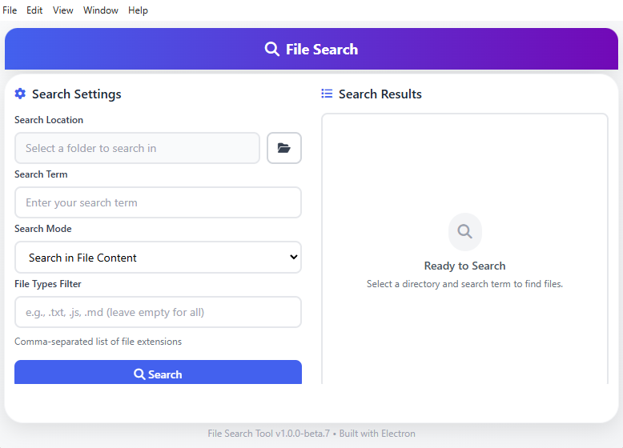

# File Search Tool

A modern, cross-platform desktop application for quickly searching files by name or content, built with Electron Forge for streamlined development and distribution.


## Screenshot



## Features

### For End Users

- **Dual Search Modes**: Search by file name or file content
- **File Type Filtering**: Filter results by specific file types (PDF, Word, Excel, images, etc.)
- **Real-time Search**: Live updates as files are added, modified, or deleted
- **File Operations**: Double-click to open files or use the folder icon to reveal file location
- **Progress Tracking**: See real-time progress with file counts and matches
- **Modern UI**: Clean, intuitive interface with visual feedback
- **Cross-Platform**: Works on Windows, macOS, and Linux

### For Developers

- **Electron Forge**: Simplified development workflow and packaging
- **File System Access**: Efficient recursive directory scanning with `fs-extra`
- **Real-time Monitoring**: File system watching with `chokidar`
- **IPC Communication**: Secure inter-process communication
- **Modern JavaScript**: ES6+ features and async/await patterns
- **Custom Preload Script**: Secure exposure of Node.js APIs

## Installation & Setup

### Prerequisites

- Node.js 18 or higher
- npm or yarn package manager

### Quick Start

1. **Install dependencies**:

   ```bash
   npm install
   ```

2. **Run the application in development mode**:

   ```bash
   npm start
   ```

3. **Package the application** (optional):

   ```bash
   npm run package
   ```

4. **Create distributable installers** (optional):
   ```bash
   npm run make
   ```

## Usage Guide

### Basic Search

1. **Select Directory**: Click the folder icon to choose where to search
2. **Enter Search Term**: Type what you're looking for in the search field
3. **Choose Search Type**: Select whether to search by file name or file content
4. **Filter by File Type** (optional): Use the dropdown to limit results to specific file types
5. **Click Search**: Start the search process

### Advanced Features

- **Custom File Types**: Select "Custom Extension" and enter extensions separated by commas (e.g., `pdf,docx,txt`)
- **Real-time Updates**: The search automatically updates when files are added, modified, or deleted
- **File Operations**:
  - Double-click any result to open the file with its default application
  - Click the folder icon next to any result to reveal the file in Explorer/Finder
- **Progress Tracking**: Watch the progress counter during large searches

### Keyboard Shortcuts

- `Enter` in search field: Start search
- `Escape`: Stop current search (when available)

## For Developers

### Project Structure with Electron Forge

```
file-search-app/
├── src/
│   ├── index.html          # Main UI structure
│   ├── index.css           # Application styles
│   ├── index.js            # Main process (Electron)
│   ├── preload.js          # Secure bridge between main and renderer
│   └── renderer.js         # Renderer process (UI logic)
├── package.json            # Dependencies and scripts
├── forge.config.js         # Electron Forge configuration
└── README.md              # This file
```

### Electron Forge Commands

- `npm start` - Start the application in development mode with hot reloading
- `npm run package` - Package the application without creating installers
- `npm run make` - Create distributable installers for all platforms
- `npm run publish` - Publish the application to GitHub or other providers

### Architecture Overview

#### Main Process (`index.js`)

- Handles file system operations
- Manages window creation and lifecycle
- Implements IPC handlers for file operations

#### Renderer Process (`renderer.js`)

- Manages UI interactions and validation
- Updates UI based on search results
- Communicates with main process via preload script

#### Preload Script (`preload.js`)

- Securely exposes specific Node.js APIs to the renderer process
- Prevents direct Node.js access from the UI for security

### Key Dependencies

- `electron`: Desktop application framework
- `@electron-forge/*`: Electron Forge tooling for development and packaging
- `fs-extra`: Enhanced file system operations
- `chokidar`: Efficient file system watching

### Development Guide

1. **Setting up the development environment**:

   ```bash
   git clone https://github.com/jhenbertgit/file-search-tool.git
   cd file-search-tool
   npm install
   ```

2. **Running in development mode**:

   ```bash
   npm start
   ```

3. **Debugging**:
   - The application opens DevTools automatically in development mode
   - Use `console.log()` statements in both main and renderer processes
   - Main process logs appear in the terminal
   - Renderer process logs appear in DevTools

4. **Adding new features**:
   - Update UI in `index.html` and `index.css`
   - Add UI logic in `renderer.js`
   - Implement backend functionality in `index.js`
   - Expose new APIs through `preload.js`

### Building for Distribution

1. **Package the application**:

   ```bash
   npm run package
   ```

   Creates platform-specific packages in the `out` directory.

2. **Create installers**:

   ```bash
   npm run make
   ```

   Generates distributable installers for Windows, macOS, and Linux.

3. **Publish** (if configured):
   ```bash
   npm run publish
   ```
   Publishes the application to configured providers like GitHub.

### API Reference

#### Main Process IPC Handlers

- `open-directory-dialog`: Opens native directory picker
- `search-files`: Initiates file search with parameters
- `open-file`: Opens file with default application
- `open-file-location`: Reveals file in file explorer
- `stop-search`: Terminates current search operation

#### Renderer Process Events

- `search-results`: Emitted when search results are available
- `search-error`: Emitted when an error occurs during search
- `search-progress`: Emitted with progress updates during search

## Configuration

### Electron Forge Configuration

The application uses Electron Forge with the following makers configured:

- **Windows**: Squirrel installer (`.exe`)
- **macOS**: ZIP archive and DMG installer
- **Linux**: DEB and RPM packages

### Customizing Build Configuration

Edit `forge.config.js` to modify:

- Application metadata
- Installer options
- Publishing targets
- Build preferences

## Troubleshooting

### Common Issues

1. **Application won't start**:
   - Ensure Node.js version 18+ is installed
   - Delete `node_modules` folder and run `npm install` again

2. **Build failures**:
   - On Windows, ensure Windows Build Tools are installed
   - On macOS, ensure Xcode Command Line Tools are installed
   - On Linux, ensure required build dependencies are installed

3. **Search is slow**:
   - Avoid searching very large directories with many small files
   - Use file type filters to narrow search scope

4. **No results found**:
   - Check that the search directory contains relevant files
   - Verify search term spelling
   - Try a less specific search term

### Performance Tips

- Use file type filters to significantly improve search speed
- For content searches, avoid searching binary files by filtering by type
- The application processes files in batches to prevent UI freezing

## Contributing

1. Fork the repository
2. Create a feature branch (`git checkout -b feature/amazing-feature`)
3. Commit your changes (`git commit -m 'Add amazing feature'`)
4. Push to the branch (`git push origin feature/amazing-feature`)
5. Open a Pull Request

## License

This project is licensed under the MIT License - see the LICENSE file for details.

## Support

For issues and questions:

1. Check the troubleshooting section above
2. Search existing GitHub issues
3. Create a new issue with detailed information about your problem

## Version History

- **v1.0** (Current)
  - Initial release with basic search functionality
  - File name and content search modes
  - File type filtering
  - File opening and location revealing
  - Electron Forge integration for streamlined development

---

**Note**: This application accesses your file system to perform searches. It only reads file contents when performing content searches and does not modify or transmit your files.